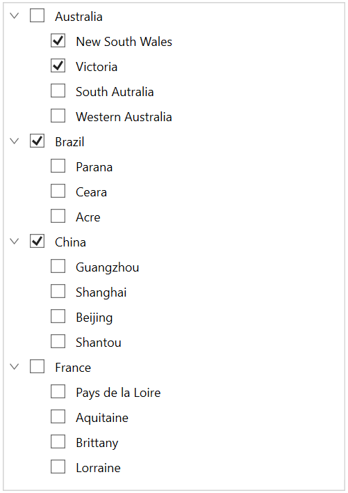

# How to Work With Check Boxes in Bound Mode in WPF TreeView?

This repository describes how to work with check boxes in bound mode in [WPF TreeView](https://www.syncfusion.com/wpf-controls/treeview) (SfTreeView).

When you are populating treeview nodes from [ItemsSource](https://help.syncfusion.com/cr/wpf/Syncfusion.UI.Xaml.TreeView.SfTreeView.html#Syncfusion_UI_Xaml_TreeView_SfTreeView_ItemsSource), then you can get or set the checked items by using [CheckedItems](https://help.syncfusion.com/cr/wpf/Syncfusion.UI.Xaml.TreeView.SfTreeView.html#Syncfusion_UI_Xaml_TreeView_SfTreeView_CheckedItems) property.

SfTreeView supports to check multiple items through binding the `CheckedItems` property from view model with `ObservableCollection<object>` type.

**Note:** Set [ItemTemplateDataContextType](https://help.syncfusion.com/cr/wpf/Syncfusion.UI.Xaml.TreeView.SfTreeView.html#Syncfusion_UI_Xaml_TreeView_SfTreeView_ItemTemplateDataContextType) as Node to bind the TreeViewNode.IsChecked property to CheckBox in ItemTemplate.

**Note:** TreeView process and sets [TreeViewNode.IsChecked](https://help.syncfusion.com/cr/wpf/Syncfusion.UI.Xaml.TreeView.Engine.TreeViewNode.html#Syncfusion_UI_Xaml_TreeView_Engine_TreeViewNode_IsChecked) based on CheckedItems only when you are binding ItemsSource.

#### XAML

``` xml
<syncfusion:SfTreeView 
            x:Name="sfTreeView"
            Margin="10"
            BorderThickness="1"
            AutoExpandMode="AllNodes"
            BorderBrush="LightGray"
            AllowDragging="True"
            SelectionMode="Multiple"
            CheckBoxMode ="Recursive"
            CheckedItems="{Binding CheckedStates}"
            ChildPropertyName="Models"
            ExpandActionTrigger="Node"
            ItemTemplateDataContextType="Node"
            FocusVisualStyle="{x:Null}"
            IsAnimationEnabled="True"                     
            ItemsSource="{Binding Items}">            
<syncfusion:SfTreeView.ItemTemplate>
        <DataTemplate>
            <Grid>                        
                <CheckBox x:Name="CheckBox" FocusVisualStyle="{x:Null}"
                                    IsChecked="{Binding IsChecked, Mode=TwoWay}"/>
                <TextBlock FontSize="12" VerticalAlignment="Center" Text="{Binding Content.State}" Margin="25,0,0,0"/>
            </Grid>
        </DataTemplate>
    </syncfusion:SfTreeView.ItemTemplate>
</syncfusion:SfTreeView>
```

#### C#

``` csharp
public class ViewModel : NotificationObject
{
    public ObservableCollection<Model> Items { get; set; }

    private ObservableCollection<object> checkedStates;

    public ObservableCollection<object> CheckedStates
    {
        get { return checkedStates; }
        set { checkedStates = value; }
    }

    public ViewModel()
    {
        Items = new ObservableCollection<Model>();
        checkedStates = new ObservableCollection<object>();
                 
        var country1 = new Model { State = "Australia" };
        var country2 = new Model { State = "Brazil" };
        var country3 = new Model { State = "China" };
        var country4 = new Model { State = "France" };

        var aus_state1 = new Model { State = "New South Wales" };
        var aus_state2 = new Model { State = "Victoria" };
        var aus_state3 = new Model { State = "South Autralia" };
        var aus_state4 = new Model { State = "Western Australia" };

        var brazil_state1 = new Model { State = "Parana" };
        var brazil_state2 = new Model { State = "Ceara" };
        var brazil_state3 = new Model { State = "Acre" };

        var china_state1 = new Model { State = "Guangzhou" };
        var china_state2 = new Model { State = "Shanghai" };
        var china_state3 = new Model { State = "Beijing" };
        var china_state4 = new Model { State = "Shantou" };

        var france_state1 = new Model { State = "Pays de la Loire" };
        var france_state2 = new Model { State = "Aquitaine" };
        var france_state3 = new Model { State = "Brittany" };
        var france_state4 = new Model { State = "Lorraine" };

        country1.Models.Add(aus_state1);
        country1.Models.Add(aus_state2);
        country1.Models.Add(aus_state3);
        country1.Models.Add(aus_state4);

        country2.Models.Add(brazil_state1);
        country2.Models.Add(brazil_state2);
        country2.Models.Add(brazil_state3);

        country3.Models.Add(china_state1);
        country3.Models.Add(china_state2);
        country3.Models.Add(china_state3);
        country3.Models.Add(china_state4);

        country4.Models.Add(france_state1);
        country4.Models.Add(france_state2);
        country4.Models.Add(france_state3);
        country4.Models.Add(france_state4);

        Items.Add(country1);
        Items.Add(country2);
        Items.Add(country3);
        Items.Add(country4);

        checkedStates.Add(aus_state1);
        checkedStates.Add(aus_state2);
        checkedStates.Add(country2);
        checkedStates.Add(country3);
    }
}
```

